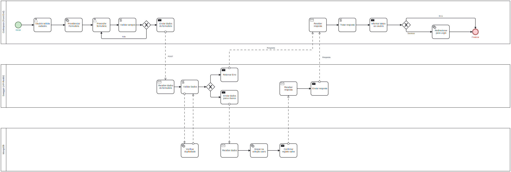
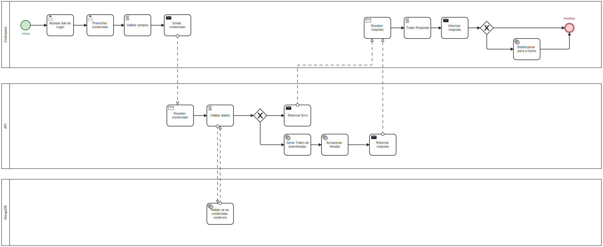

# task-list
Tema do projeto: Lista de Tarefas

Este é um projeto educaional, nele foi implementado cadastro e login de usuário. O projeto foi projeto utilizando o BPMN:

Cadastro Pessoal:

Login:

Neste projeto contém:
- [x] Conexão com o mongoDB Atlas
- [ ] Documentação utilizando o Swagger
- [x] Encriptação de senha usando bcrypt
- [x] Geração de token de autênticação utilizando o JWT
- [ ] Deploy no Seenode

Features:
- [x] Cadastro pessoal
- [x] Login com autênticação

Integrantes:
- Anthony Alencar Wollena
- Victor Myke Gracioli Rocha
- Vinicius da Silva Nunes